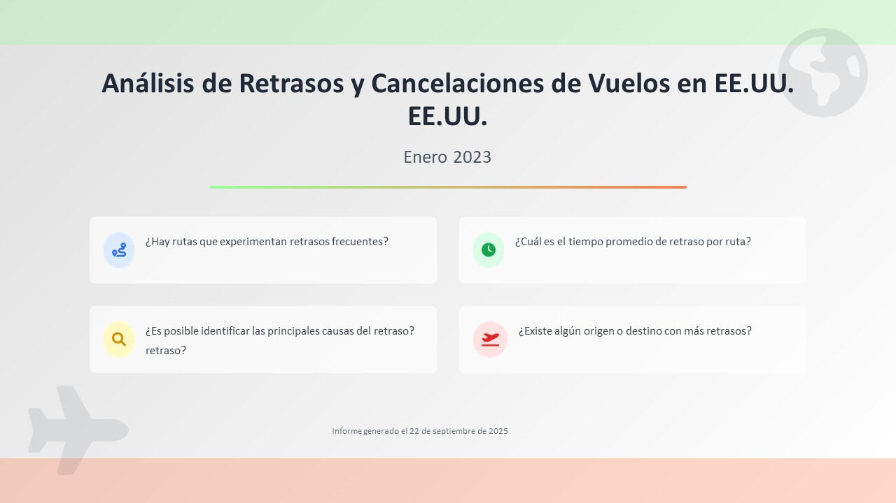

# ✈️ Análisis de Retrasos de Vuelos en EE.UU.

Este proyecto analiza retrasos de vuelos en Estados Unidos utilizando Python y Jupyter Notebooks.  
El objetivo es identificar patrones de retrasos por **origen, destino y causas principales**, y generar recomendaciones para mejorar la puntualidad.

---

## 📂 Estructura del repositorio

```text
├── data/
│   ├── flights_202301.csv
│   ├── flights_merged.csv
│   ├── flights_typed.csv
│   ├── AIRLINE_CODE_DICTIONARY.csv
│   └── DOT_CODE_DICTIONARY.xlsx
│
├── notebooks/
│   ├── Proyecto3_Vuelos.ipynb
│   └── Proyecto3_Vuelos_voila_v2.ipynb
│
├── outputs/
│   ├── Análisis de Retrasos y Cancelaciones de Vuelos en EE.UU. (Enero 2023).pptx
│   ├── Proyecto_3_Vuelos_voila_v2 (21_9_2025 22：15：26).HTML
│   ├── Análisis de Retrasos y Cancelaciones de Vuelos en EE.UU. (Enero 2023).pdf
│   ├── ppt_preview/
│        ├── Slide1-12.jpg
│   └── requirements_voila.txt
│
└── README.md
```

---

## 🚀 Metodología

1. **Carga y limpieza de datos**  
   - Integración de múltiples datasets de vuelos (DOT, aerolíneas, aeropuertos).  
   - Estandarización de columnas y tipos de datos.  

2. **Análisis exploratorio (EDA)**  
   - Retrasos por ruta, origen y destino.  
   - Identificación de causas más frecuentes.  
   - Cálculo del tiempo promedio de retraso.  

3. **Visualización de resultados**  
   - Gráficas interactivas en notebooks.  
   - Presentación ejecutiva en PowerPoint/PDF.  

---

## 📊 Principales hallazgos

- Algunos **aeropuertos regionales y turísticos** presentan los mayores porcentajes de retrasos.  
- El **tiempo promedio de retraso** varía considerablemente por ruta y condiciones climáticas.  
- Se identificaron **causas recurrentes** ligadas a clima, congestión y factores operativos.  

---

## 📑 Presentación

Vista previa de la presentación de resultados:  

[](outputs/Análisis%20de%20Retrasos%20y%20Cancelaciones%20de%20Vuelos%20en%20EE.UU.%20(Enero%202023).pdf)

> 📌 Haz clic en la imagen para abrir la presentación completa en PDF.  

---

## 🔧 Requerimientos

Instala las dependencias necesarias desde el archivo `requirements_voila.txt`:

```bash
pip install -r outputs/requirements_voila.txt


